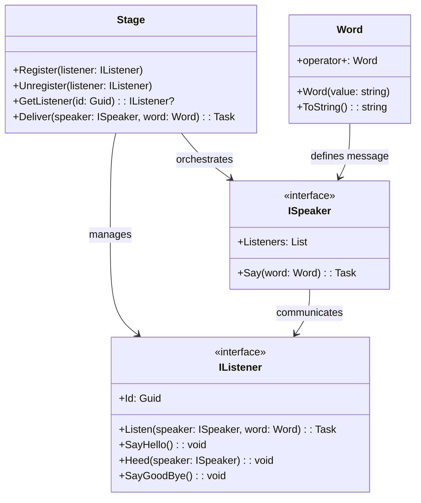

# Stage Design Pattern

## Description

The **Stage Design Pattern** is a behavioral design pattern that introduces a disciplined approach to asynchronous communication between objects. It enforces explicit roles for participants (`Speaker` and `Listener`) and centralizes communication management via a shared "Stage." This pattern promotes scalability, maintainability, and traceability, making it suitable for modern, complex architectures.

---

## Documentation

### Pattern Name and Classification

**Stage Design Pattern**  
Classification: Behavioral Pattern  

---

### Intent

The **Stage Design Pattern** provides a disciplined approach to asynchronous communication between objects by explicitly defining roles and responsibilities for message emission (`Speaker`) and reception (`Listener`). This pattern enforces a clear contract for classes involved in communication, ensuring decoupled yet structured interactions.

---

### Also Known As

- Speaker-Listener Pattern  
- Role-Based Communication Pattern

---

### Motivation (Forces)

In many systems, components must communicate without knowing the internal details of one another. Traditional messaging systems (e.g., pub/sub frameworks or event buses) often create implicit dependencies, leading to tightly coupled or untraceable relationships.

For example:
- A UI component needs to react to changes in business logic without directly depending on it.
- A background service must notify multiple subscribers of its state without knowing the subscribers themselves.

The **Stage Design Pattern** solves these challenges by:
1. Explicitly defining roles for communication (e.g., `Speaker` and `Listener`).
2. Centralizing the management of relationships via a shared "Stage."
3. Enforcing structured interaction while maintaining a high level of decoupling.

---

### Applicability

Use the **Stage Design Pattern** when:
- You need controlled communication between components while maintaining clear separation of concerns.
- Components in different layers (e.g., UI, business logic) need to communicate asynchronously without tightly coupling.
- Scalability and asynchronous processing of messages are required.
- Explicit roles for message handling are beneficial to system clarity.

---

### Structure

#### Class Diagram


### Participants

- **Stage**: The central registry managing listeners and delivering messages from speakers.
- **IListener**: Interface for classes that can receive and process messages.
- **ISpeaker**: Interface for classes that emit messages to listeners.
- **Word**: A validated, immutable message type used in communication.

---

### Collaboration

1. A **Listener** registers itself with the `Stage`, associating its unique `Id`.
2. A **Speaker** emits messages using `Say`, which invokes `Stage.Deliver` to process and distribute the message asynchronously to all relevant listeners.
3. The `Stage` identifies listeners by their `Id` and ensures proper delivery while maintaining decoupling between **Speaker** and **Listener**.

---

### Consequences

#### Benefits
- **Explicit Responsibility**: Classes explicitly define their roles (speaker, listener, or both).
- **Decoupling**: The `Speaker` doesn't know its listeners; it only interacts with their `Id`.
- **Traceability**: Clear paths for communication improve debugging and maintainability.
- **Scalability**: Asynchronous processing allows handling a large number of listeners efficiently.

#### Trade-offs
- **Setup Complexity**: Requires implementing interfaces and registering objects explicitly.
- **Overhead**: Centralized management (e.g., weak references) may introduce slight runtime costs.

---

### Implementation

1. Define `IListener` and `ISpeaker` interfaces.
2. Create a `Stage` class as the central registry for listeners.
3. Use `Word` to encapsulate and validate messages.
4. Implement roles (`Listener` and `Speaker`) in application-specific classes.

Sample Code
Listener and Speaker
```csharp
public class MyListener : IListener {
    public Guid Id { get; } = Guid.NewGuid();

    public async Task Listen(ISpeaker speaker, Word word) {
        Console.WriteLine($"Received word: {word} from {speaker.GetType().Name}");
    }
}

public class MySpeaker : ISpeaker {
    public List<Guid> Listeners { get; } = new();

    public async Task Say(Word word) {
        await Stage.Deliver(this, word);
    }
}
```

Register and Communicate

```csharp
var listener = new MyListener();
listener.SayHello(); // Register the listener

var speaker = new MySpeaker();
speaker.Listeners.Add(listener.Id); // Link speaker to listener

await speaker.Say(new Word("HELLO")); // Send a message
listener.SayGoodBye(); // Unregister listener
```

### Known Uses

The **Stage Design Pattern** is suitable for scenarios where structured, asynchronous communication between objects is essential. Some practical use cases include:

1. **Warehouse Management Systems**:  
   - Devices (e.g., scanners, picking devices) need to communicate asynchronously and efficiently without direct knowledge of each other. The `Stage` pattern facilitates clear communication while maintaining scalability.
   
2. **Distributed Systems**:  
   - Systems requiring a clear separation between producers and consumers, such as event-driven architectures, benefit from the decoupling and traceability provided by `Stage`.

3. **Real-Time User Interfaces**:  
   - Interfaces that need to react dynamically to backend events (e.g., notifications, updates) can use `Stage` to ensure communication is asynchronous and well-structured without tightly coupling UI components to backend logic.

---

### Detailed Comparison with Related Patterns

The **Stage Design Pattern** shares similarities with other behavioral patterns but introduces unique features that distinguish it. Below is a detailed comparison.

---

#### **Comparison Table**

| Pattern                | Purpose                                                                                 | Similarities                                                                                              | Differences                                                                                             |
|------------------------|-----------------------------------------------------------------------------------------|----------------------------------------------------------------------------------------------------------|---------------------------------------------------------------------------------------------------------|
| **Chain of Responsibility** | Passes a request along a chain of handlers until one processes it.                      | Both separate sender and receiver.                                                                       | Chain is sequential and linear, while Stage delivers messages asynchronously and in parallel.          |
| **Command**            | Encapsulates a request as an object to execute it later.                                 | Both abstract the sender's intent from the receiver's execution.                                         | Command focuses on delayed execution; Stage facilitates message delivery.                              |
| **Interpreter**        | Defines a grammar and interprets sentences in that grammar.                              | None.                                                                                                    | Interpreter is for language evaluation, while Stage is for object communication.                       |
| **Iterator**           | Provides sequential access to elements in a collection.                                 | None.                                                                                                    | Iterator accesses collections, while Stage handles message delivery.                                   |
| **Mediator**           | Centralizes control of interactions between objects.                                     | Centralized communication management.                                                                    | Mediator enforces interaction rules; Stage focuses solely on structured message delivery.              |
| **Observer**           | Notifies dependent objects of changes to a subject's state.                              | Both notify multiple receivers and decouple sender and receiver.                                         | Observer has direct subject-observer relationships; Stage uses centralized management via IDs.          |
| **State**              | Allows an object to change behavior when its internal state changes.                     | None.                                                                                                    | State focuses on object behavior transitions; Stage focuses on inter-object communication.             |
| **Strategy**           | Defines a family of interchangeable algorithms.                                         | Both abstract responsibilities to defined roles.                                                         | Strategy selects algorithms; Stage facilitates communication.                                          |
| **Template Method**    | Defines the skeleton of an algorithm, delegating specific steps to subclasses.           | None.                                                                                                    | Template Method is algorithmic; Stage is for object communication.                                     |
| **Visitor**            | Defines new operations on object structures without modifying their classes.             | None.                                                                                                    | Visitor operates on hierarchical structures; Stage facilitates independent communication.              |
| **Messaging Center**   | A common messaging approach allowing global publishing and subscribing.                  | Both facilitate message broadcasting.                                                                    | Messaging Center lacks roles and introduces untraceable dependencies; Stage enforces explicit roles.   |

---

#### **Analysis by Pattern**

##### 1. **Chain of Responsibility**
- **Similarities**: Separates the sender of a request from its receiver.
- **Differences**: Chain processes requests sequentially, one handler at a time, while Stage delivers messages to multiple receivers in parallel asynchronously.

##### 2. **Command**
- **Similarities**: Both abstract away the sender's intent from the receiver's execution.
- **Differences**: Command focuses on encapsulating actions to allow delayed or queued execution. Stage is not about actions but about delivering structured messages.

##### 3. **Mediator**
- **Similarities**: Both centralize communication and decouple components.
- **Differences**: Mediator manages interaction rules and dependencies. Stage only centralizes and facilitates message delivery, leaving message handling logic to receivers.

##### 4. **Observer**
- **Similarities**: Both notify multiple receivers when an event occurs and decouple sender and receivers.
- **Differences**: Observer creates direct subject-observer relationships, while Stage uses a registry (`Stage`) to manage receivers through unique IDs, enforcing explicit participation.

##### 5. **Messaging Center**
- **Similarities**: Both enable broadcasting of messages to multiple receivers.
- **Differences**: Messaging Center allows unrestricted publishing and subscribing, often leading to untraceable dependencies. Stage enforces explicit roles (`Speaker`, `Listener`) and controlled registration via the `Stage`.

##### 6. **Others (Interpreter, Iterator, State, Strategy, Template Method, Visitor)**
These patterns differ fundamentally from Stage as they focus on specific algorithmic, state, or structural problems, while Stage focuses on structured and asynchronous object communication.

---

### Key Takeaways

1. **Stage vs. Mediator**:  
   While both centralize communication, Mediator enforces interaction rules and often orchestrates complex workflows. Stage is simpler, focusing solely on structured and efficient message delivery.

2. **Stage vs. Observer**:  
   Observer ties subjects to observers directly, which can lead to tight coupling. Stage avoids this by using a central registry (`Stage`) and requiring explicit participation.

3. **Stage vs. Messaging Center**:  
   Messaging Center promotes unstructured communication, which can lead to hidden dependencies and maintenance issues. Stage enforces explicit roles and controlled registration, fostering better traceability and responsibility.

4. **Stage as Unique**:  
   The **Stage Design Pattern** offers a unique solution by combining aspects of centralized control (Mediator) with structured message delivery (Observer) while avoiding the pitfalls of global messaging systems (Messaging Center).

### Summary

The **Stage Design Pattern** introduces a unique and disciplined approach to object communication that overcomes the limitations of existing patterns:

- **Observer Pattern**: Centralizes and decouples communication.
- **Mediator Pattern**: Focuses solely on message delivery, not interaction rules.
- **Messaging Center**: Adds traceability and explicit responsibility while avoiding global dependencies.

This README provides a comprehensive overview of the **Stage Design Pattern**, its purpose, and its practical applications. Contributions, feedback, and questions are welcome to improve and expand upon this pattern.
